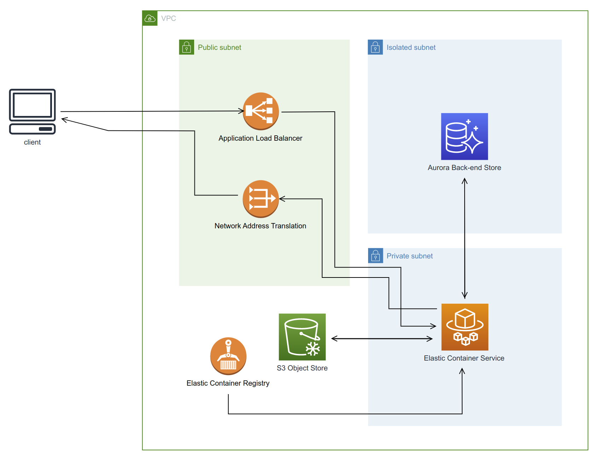
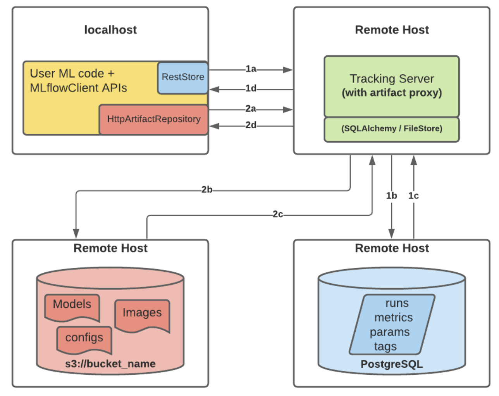

# Machine Learning Operations in Production
Infrastructure for machine learning operations. Want to remotely host a data store for machine learning. Will use Mlflow for systematically recording experiments, AWS fargate to host the mlflow server remotely, AWS S3 as a artifact store (model weights, ids-to-tokens, etc.) and AWS Aurora database management service for the backend store of Mlflow (model metrics, version info, etc. )

## Architecture proposal

Incoming requests are sent to the application load balancer, forwarding to the fargate task serving the MLFlow tracking server. Any responses from the server are routed through the network address translationgate way, and backout the internet gate.

**Note no authentication is shown in diagram, but will be added behind load balancer using reversed proxy. See: https://github.com/ntropy-network/oauth2-proxy**

## MLFlow related logic

To restrict public access to the artifact and backend store, a remote host is used as a proxy to interact with the storage services. 

**Note**: Using Mysql backend __not__ PostgreSQL as the diagram suggests.

