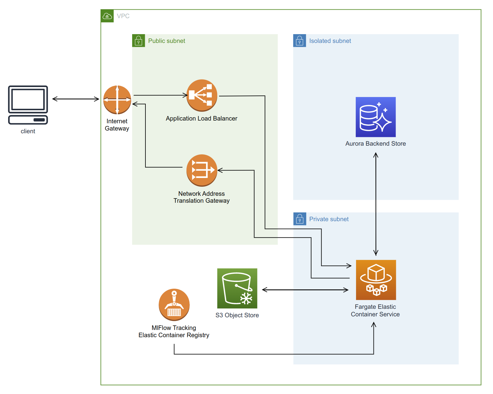
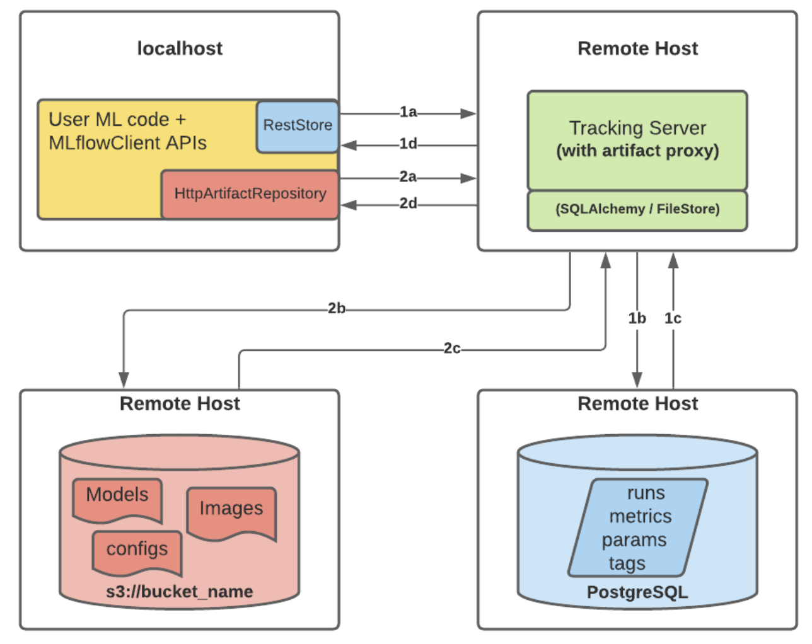

# dmlflow


## Overview 
dmlflow is a repository containing infrastructure as code and application code to deploy an [MLFlow](https://mlflow.org/) server to AWS. The infrastructure as code language used is [Terraform](https://www.terraform.io/). Mlflow is a framework for systematically recording experiments and acts as a model registry. [AWS fargate](https://aws.amazon.com/fargate/) is used to host the Mlflow server remotely, [AWS S3](https://aws.amazon.com/s3/) as a artifact store (model weights, ids-to-tokens, etc.) and [AWS Aurora](https://en.wikipedia.org/wiki/Amazon_Aurora) as a  database management service for the backend store of Mlflow (model metrics, version info, etc. )

## Usage 
Clone the repository. Then, to ensure you have all the required CLI tools, run the script: 
```
./check_cli_tools.sh 
```
To remotely deploy the service, run the script:
```
./deploy.sh
```

## System

Incoming requests come through the [internet gateway](https://docs.aws.amazon.com/vpc/latest/userguide/VPC_Internet_Gateway.html) and  are sent to the [application load balancer](https://aws.amazon.com/elasticloadbalancing/application-load-balancer/), which forwards the request to the fargate task serving the MLFlow tracking server. Any responses from the server are routed through the [network address translation gateway](https://docs.aws.amazon.com/vpc/latest/userguide/vpc-nat-gateway.html) between the private and public subnets, and back out the internet gate to the tracking service user.

**Note no authentication is set up yet, will be using basic single user authentication via an Nginx Proxy** 

**Note** When wanting to configure the tracking server as below, there is a conflict between the flags: `--default-artifact-root` and `--artifacts-destination`. 

*Option 'default-artifact-root' is required, when backend store is not local file based*

This suggests that artifacts are fire written to storage locally (to the fargate task) and later sent to their artifact destination. The implications are: A Reasonable storage ammount should be provided to the fargate task, possibly a NFS. 


## MLFlow related logic

To restrict public access to the artifact and backend store, a remote host is used as a proxy to interact with the storage services. 

**Note**: Using Mysql backend __not__ PostgreSQL as the diagram suggests.

## To dos:
- write `deploy.sh` and `remove.sh` to easily deploy and remove the service
