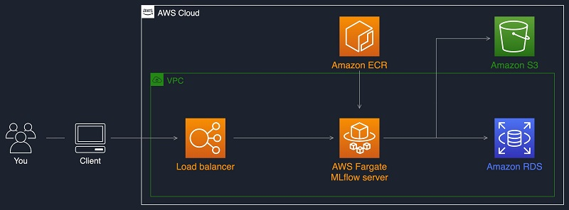

# Machine Learning Operations in Production
Infrastructure for machine learning operations. Want to remotely host a data store for machine learning. Will use Mlflow for systematically recording experiments, AWS fargate to host the mlflow server remotely, AWS S3 as a artifact store (model weights, ids-to-tokens, etc.) and AWS Aurora database management service for the backend store of Mlflow (model metrics, version info, etc. )

**Production environment set up**

**Note no authentication is shown in diagram, but will be added behind load balancer using reversed proxy. See: https://github.com/ntropy-network/oauth2-proxy**

